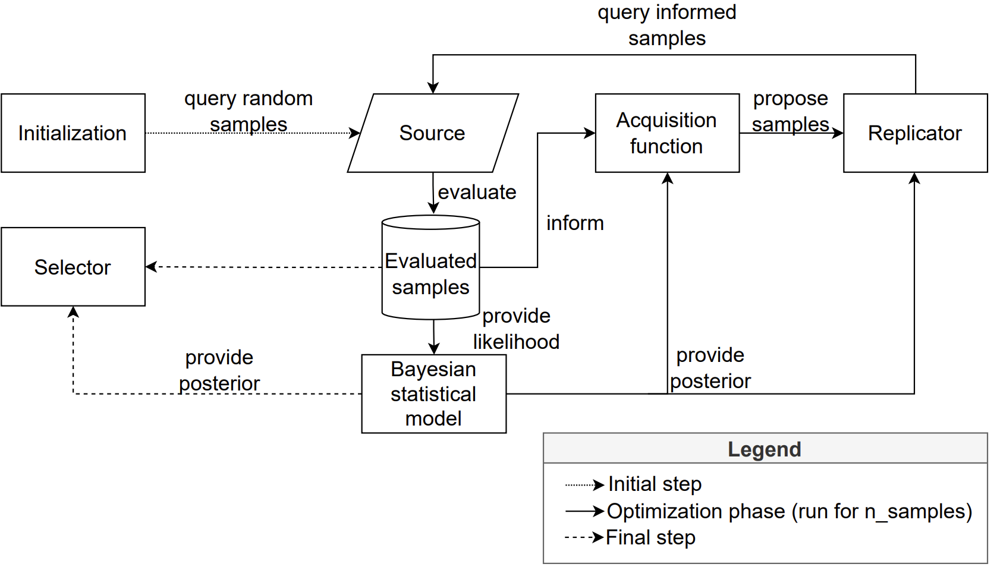

# OnlineOptimization
This is a master's thesis project on the online optimization of experimental parameters. The project is designed in a modular fashion, where different components of a (Bayesian) optimization process can be chained into a single optimization pipeline.

## Installation
The software is built on several dependencies that need to be installed prior to getting started. The installation can be performed using either `conda` or `pip`:

```conda env create -f environment.yaml```

```pip install -r requirements.txt```

If desired, support for a virtual `poetry` environment could be added too. As of now, this functionality is not supported. 

## Getting started
The optimization algorithm that is used in this project is defined in the `Optimizer` class (`src/optimization/optimizer.py`). The optimizer, optimizing some simulated function on the domain [0, 1] can be called as follows:

```python
from src.optimization import Optimizer

# Define hyperparameters
random_sample_size =    # some integer
informed_sample_size =  # some integer
simulator =             # A source that can be evaluated

# Create optimizer
opt = Optimizer(
                n_random_samples=random_sample_size,
                domain=[[0], [1]],
                initializer="sobol",
                acquisition="ucb",
                selector="variance",
                regression_model="Gaussian process regression",
                beta=0.4,
            )

for i in range(random_sample_size + informed_sample_size):
    # Sample a newly proposed position from the BO
    sample = opt.query(n_samples=1)

    # Evaluate the sample
    outcome = simulator.sample(sample, noise=True)

    # Inform the BO process
    opt.inform(sample, outcome)

# Get the final verdict
guess = opt.select().detach().numpy()
```
For a more elaborate example including the simulation of a BCI experiment, I'd like to refer the reader to `evaluate_subjects.py`.
## Theory
This repository provides an implementation of an optimization pipeline, which aims to find the parameter values that optimize an unknown objective function. 
### General problem domain
Suppose that we would like to optimize a function $f(x)$ for which there is neither information about the gradient, nor an analytical expression for the optimum available. Furthermore, consider that the evaluation of $f(x)$ is _noisy_, i.e.

$$y(x) = f(x) + \mathcal{N}(0, \varepsilon)$$

where $y(x)$ is the evaluated value for the parameters $x$, and $\varepsilon$ is the unknown variance of the (normally) distributed noise that is superimposed on our objective function $f(x)$. If $f(x)$ is expensive to evaluate, we wish to make the search for the optimal values of $x$ as effective as possible. To that end, (different variations) of **Bayesian optimization** and **evolutionary computing** have been proposed.

### Optimization pipeline
The Bayesian optimization algorithm consists out of two main components:

- A **Bayesian statistical model** that is used to model the objective function. Due to its Bayesian nature, the statistical model provides a posterior distribution over the parameter values $x$. 
- An **acquisition function** that, given the statistical model, proposes a new set of parameter values to evaluate. 

The posterior distribution of the statistical model is updated given the samples that are proposed by the acquisition function. The acquisition function on its turn, uses the posterior distribution to make a new suggestion for what parameter values to explore. This two-step process repeats for a fixed number of iterations or until convergence. 

Once the optimization process is finished, the model should yield the values for $x$ that are the most likely to optimize the objective function. 

### Design
The coded pipeline is designed to be as flexible as possible. Therefore, the different components of the optimization pipeline are represented by the following modules. 
The interplay between the modules is described in the figure below.

<p align="center">

</p>

All modules can be found in the `src/modules/` folder.

#### Initial sampling
To gather the initial training data for the statistical model, (quasi-)random values are sampled from the space from $x$ and evaluated. Currently, the following samplers are supported:

- `Random`, samples values uniformly across the input domain. 
- `Sobol`, a quasi-random sampler that samples sequences with a low discrepancy, based on the sequences proposed in [1].

#### Statistical models
The statistical models that can be used to approximate the objective function are:

- `MostLikelyHeteroskedasticGP`, a Gaussian process regression model that is designed to model processes that are superimposed with heteroskedastic noise. The model is proposed in [2] and built with the [`Botorch`](https://botorch.org/) library.
- `RandomForestWrapper`, a random forest regression model that provides a posterior distribution over the input space. The model is based on the [`RandomForestRegressor`](https://scikit-learn.org/stable/modules/generated/sklearn.ensemble.RandomForestRegressor.html) from the [`sklearn`](https://scikit-learn.org/stable/index.html) library, where an estimate of the posterior distribution over the different trees is added according to the proposal in [3].

#### Acquisition functions
The pipeline is compatible with all acquisition functions that are provided by [`Botorch`](https://botorch.org/) ([`botorch.acquisition`](https://botorch.org/api/acquisition.html)).

- `BoundedUpperConfidenceBound`, an adaption to the UpperConfidenceBound acquisition function where the exploration-exploitation-tradeoff-parameter $\beta$ is constrained between [0, 1] instead of [0, inf]. 

#### Replicators
Replicators use a roll-out strategy to decide whether to sample a new value, or to replicate an existing sample to make a better assessment of the noise, as for example suggested in [4].

- `MaxReplicator`, a replicator that replicates the parameters that are associated with the highest evaluated value of `y` if the proposed `x` is very close to the maximizing `x`, and the noise of the maximizing `x` is only slightly lower than the noise of the proposed `x`.

#### Selectors
Selectors the modules that select the sample that is the most likely to optimize the objective function. Currently supported selectors are:

- `SimpleSelector`, makes a verdict by combining the values of $y(x)$ and the variance that is estimated by the statistical model.
- `Variance`, a selector that can use the convergence measures `length_scale` and `mse` to weigh the posterior mean of the surrogate model and the observed samples. 

#### Simulators
The simulator modules represent the source whereto queries can be made to evaluate samples. Currently supported sources are:

- `ERPSimulator`, a source that is able to simulate ERP data.
- `CVEPSimulator`, a source that is used to simulate CVEP data. This source is not completely bug-free. 

The simulators can be found in the folder `src/data/`

***
**Features**
- Modularity
- Scales to any dimension
***
## References
[1] I.M Sobol, "On the distribution of points in a cube and the approximate evaluation of integrals", _USSR Computational Mathematics and Mathematical Physics_, Volume 7, Issue 4, 1967, Pages 86-112, ISSN 0041-5553, https://doi.org/10.1016/0041-5553(67)90144-9. <br>
[2] Kristian Kersting, Christian Plagemann, Patrick Pfaff, and Wolfram Burgard. 2007. Most likely heteroscedastic Gaussian process regression. In _Proceedings of the 24th international conference on Machine learning (ICML '07). Association for Computing Machinery, New York, NY, USA, 393–400. https://doi.org/10.1145/1273496.1273546 <br>
[3] Frank Hutter, Lin Xu, Holger H. Hoos, Kevin Leyton-Brown, Algorithm runtime prediction: Methods & evaluation, _Artificial Intelligence_, Volume 206, 2014, Pages 79-111, ISSN 0004-3702, https://doi.org/10.1016/j.artint.2013.10.003. <br>
[4] Mickaël Binois, Jiangeng Huang, Robert B. Gramacy & Mike Ludkovski (2019) Replication or Exploration? Sequential Design for Stochastic Simulation Experiments, _Technometrics_, 61:1, 7-23, DOI: 10.1080/00401706.2018.1469433 <br>